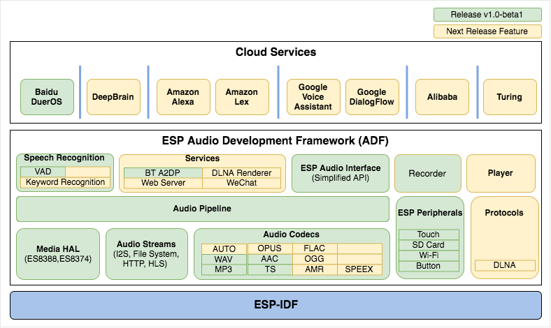

# Espressif Audio Development Framework

[](https://esp-adf.readthedocs.io/en/latest/?badge=latest)

Espressif Systems Audio Development Framework (ESP-ADF) is the official audio development framework for the [ESP32](https://espressif.com/en/products/hardware/esp32/overview) chip.

## Overview

ESP-ADF supports development of audio applications for the Espressif Systems [ESP32](https://espressif.com/en/products/hardware/esp32/overview) chip in the most comprehensive way. With ESP-ADF, you can easily add features, develop audio applications from simple to complex:
- Music player or recorder supports audio formats such as MP3, AAC, WAV, OGG, AMR, TS, SPEEX ...
- Play music from sources: HTTP, HLS(HTTP Live Streaming), SDCARD, Bluetooth A2DP/HFP
- Integrate Media services such as: DLNA, WeChat ...
- Internet Radio
- Voice recognition and integration with online services such as Alexa, DuerOS, ...

As a general, the ESP-ADF features will be supported as shown below:




## Developing with the ESP-ADF

### Quick Start

You need the ESP32 LyraT board and headphone connected, make sure you clone the project recursive: 

```
git clone --recursive https://github.com/espressif/esp-adf.git 
cd esp-adf/examples/get-started 
make menuconfig
make flash monitor
```

If you clone project without `--recursive` flag, please goto the `esp-adf` directory and run command `git submodule update --init` before doing anything.

### Hardware

Espressif Systems has released a number of support boards for ESP-ADF to develop ESP32 audio applications, including:

#### ESP32-Lyrat

[ESP32 LyraT V4 Getting Started Guide](./docs/en/get-started/get-started-esp32-lyrat-v4.rst)


#### ESP-IDF

ESP-**A**DF is based on the application layer of ESP-**I**DF ([Espressif IoT Development Framework](https://github.com/espressif/esp-idf)). So you need to first install the ESP-IDF and then use the ESP-ADF. Please take a look at [Get Started](https://esp-adf.readthedocs.io/en/latest/get-started/index.html)

#### Examples

Check folder [examples](examples) that contains sample applications to demonstrate API features of the ESP-ADF.

# Resources

* Documentation for the latest version: https://esp-adf.readthedocs.io/. This documentation is built from the [docs directory](docs) of this repository.

* The [esp32.com forum](https://esp32.com/) is a place to ask questions and find community resources.

* [Check the Issues section on github](https://github.com/espressif/esp-adf/issues) if you find a bug or have a feature request. Please check existing Issues before opening a new one.

* If you're interested in contributing to ESP-ADF, please check the [Contributions Guide](https://esp-idf.readthedocs.io/en/latest/contribute/index.html).

